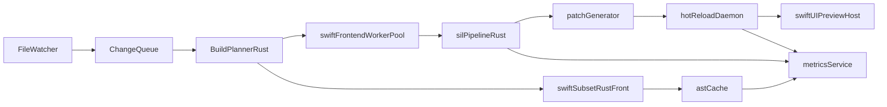

# Hybrid MVP Architecture

## Concurrency-first flow

## Shared protocol

See `shared/protocol/events.schema.json`.

## Cancellation model

- Every build wave carries `build_id`.
- New edits cancel old tasks by dropping cancellation token.
- Workers check token before and after expensive steps.

## SwiftUI reload policy

1. Try patch-based reload.
2. If compatibility check fails, trigger deterministic host restart.
