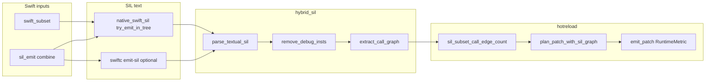

# Execution roadmap (multi-stream plan)

This document **synthesizes** parallel planning passes over the `inauguration` repo (SIL → hotreload, rust-driver / hybrid mirror, CI / `in` CLI, polyglot fronts). It **does not replace** [architecture/future-work-roadmap.md](architecture/future-work-roadmap.md); use both together—future-work stays the product narrative; this file is **execution ordering**, file pointers, and **risk registers**.

## How to read this

| Stream | Primary payoff |
|--------|----------------|
| **A — SIL & hotreload** | Safer patch planning, fewer false hot patches, better metrics. |
| **B — `in` CLI & CI** | `in test` matches contributor machines; Linux CI without Swift; clearer failures. |
| **C — rust-driver & hybrid** | Single source of truth, timings, benches, artifact contracts. |
| **D — Polyglot & Core IR** | Parser routing → lowering → SIL parity across fronts. |

Suggested **program order**: **B0** (CI unblocks everyone) → **C0** (parity guardrails) → **A0–A1** (SIL signal quality) in parallel with **D0** (one front deepened per milestone).

---

## Stream A — SIL call graph → hotreload patch planning

### Goals

- Evolve from scalar **`sil_call_edges: Option<u32>`** toward **structured graph context** for `plan_patch`, without increasing **false `ViewBody`** applications.
- Keep **`sil_emit::compile_check_swift_path`**, **`try_emit_in_tree_sil`**, and **`hybrid_sil::extract_call_graph`** semantics aligned on **the same combined sources** wherever feasible.

### Current state (verified)

| Stage | Location | Role |
|--------|-----------|------|
| Subset SIL | `in-cli/src/native_swift_sil.rs` — `try_emit_in_tree_sil`, `program_to_textual_sil` | Fast path; merged SIL with `function_ref @helper` wiring from **`@main`**. |
| Full Swift / swiftc | `in-cli/src/sil_emit.rs` — `emit_textual_sil`, `compile_check_swift_path` | `swiftc -emit-sil` when subset not used. |
| Graph | `in-cli/src/hybrid_sil.rs` — `parse_textual_sil`, `remove_debug_insts`, **`extract_call_graph`** | `SilAnalysisReport { call_edges: ... }` + `instruction_callers`. |
| Daemon | `in-cli/src/hotreload/daemon_impl.rs` — **`sil_subset_call_edge_count`**, **`plan_patch_with_sil_graph`**, **`emit_patch`**, **`RuntimeMetric`** | Today: **edge count only** from subset path; `None` when subset emit fails (full Swift may still compile). |
| Heuristics | Same file — **`QueryGraph`**, **`infer_deps_for_path`**, **`symbols_for_path`** | **Not** SIL-driven today. |

**Important contract:** subset stub graph **≠** Swift semantic call graph; **`main` → all helpers** inflates counts vs real control flow.

### Phases

| Phase | Scope | Key files |
|-------|--------|-----------|
| **A0** | **Done:** `sil_subset_call_edges_detail` + **`sil_graph=*`** tags on daemon **`reason`** (subset vs unavailable vs skipped compile, etc.). Double subset work unchanged for now. | `daemon_impl.rs` |
| **A1** | Pass capped **`SilAnalysisReport`** (or callee set) into **`plan_patch_with_sil_graph`**; rules e.g. downgrade only if callees intersect **changed symbol names** (needs name ↔ file mapping—may be stubbed first). | `daemon_impl.rs`, `hybrid_sil.rs` |
| **A2** | Optional **`swiftc`** SIL graph behind env + **timing** in metrics; unify input resolution with **`combined_swift_sources_for_path`**. | `sil_emit.rs`, `daemon_impl.rs` |
| **A3** | Multi-function **`SilArtifact`** stability; protocol optional fields for host tooling; mirror **`compiler/rust-driver/crates/sil`**. | `hybrid_sil.rs`, `shared/protocol/`, rust-driver `sil` |

### Risks

- **False `ViewBody`**: `n > 0` only proves template `function_ref` lines exist.
- **`sil_call_edges: None`** on swiftc-success path: document as conservative or close the gap deliberately.
- **Drift**: `hybrid_sil` legacy caller attribution if `instruction_callers` empty—tests in `hybrid_sil.rs` must stay green.

### Success metrics

- NDJSON **`reason`** distinguishes graph source; regression tests for every new **`plan_patch`** branch.
- p95 **`compile_check_ms`** flat when A2 adds optional swiftc SIL.

---

## Stream B — `in` CLI, `in test`, installer, CI

### Goals

- Contributors run **`in test`** locally with minimal friction; CI gives **maximum signal** without requiring Swift on Linux.

### Current state

- **`in test`** (`in-cli/src/main.rs`): protocol script → rust-driver `cargo test --all` → `in-cli` → SwiftPM clean/test → `hotreload-daemon`. Requires **workspace root** (see `workspace_root`).
- **`IN_TEST_SKIP_SWIFT`**: skips SwiftPM steps; documented in `AGENTS.md`.
- **`in update`**: checkout path **`cargo install --path in-cli --locked`**; Unix fallback **`curl | bash`** on raw `install.sh` with validated **`IN_REPO`** slug.
- **GitHub Actions** (`.github/workflows/ci.yml`): **`cargo test`** in `in-cli` only; **`cargo test -p hybrid-cli`** in rust-driver; sample scripts—**does not** run full **`in test`** today.

### Phases

| Phase | Scope |
|-------|--------|
| **B0** | **Done in CI:** jobs **`in-test-linux`** (`IN_TEST_SKIP_SWIFT=1`) + **`in-test-macos`** (full), build `in` then `in test`. |
| **B1** | **`in doctor`**: check `bash`, `curl`, `swift`, `cargo` versions; print whether remote **`in update`** would work. |
| **B2** | Optional **`IN_TEST_SKIP_PROTOCOL=1`** / staged modes if script deps are heavy for sandboxes. |
| **B3** | Document “airgapped” path: no network → use checkout **`in update`** only. |

### Risks

- Full **`in test`** on Linux without Swift: must use **`IN_TEST_SKIP_SWIFT`** or split jobs.
- Remote **`in update`**: requires network + trust boundary—already documented; slug validation prevents trivial injection.

---

## Stream C — `compiler/rust-driver` ↔ `in-cli` hybrid mirror

### Goals

- **No silent drift** between `compiler/rust-driver/crates/{core,scheduler,sil,pipeline}` and `in-cli/src/hybrid_*.rs`.
- **Stage timing policy**: one coherent definition of **`total_us`** vs wall time; optional JSON / `tracing` spans.

### Current state

- Headers in `in-cli` hybrid modules point at rust-driver crate paths (inlined for single-crate publish).
- **`run_wave_with_timings`**: `AstRefresh` / `SwiftFrontend` are **placeholders**; real work is **before** the wave in **`run_pipeline_for_path`** (`main.rs`).
- **No Criterion benches** under `compiler/rust-driver` for hybrid paths today.

### Phases

| Phase | Scope |
|-------|--------|
| **C0** | **Partial:** job **`hybrid-libs`** runs `cargo test -p hybrid-pipeline -p hybrid-sil -p hybrid-core -p hybrid-scheduler` on ubuntu. (Byte-diff parity still future.) |
| **C1** | Align **`total_us`** semantics + document two clocks if both are kept (`wave_us` vs `pipeline_us`). |
| **C2** | Criterion bench: **`parse_textual_sil` + `extract_call_graph`** on representative SIL blobs. |
| **C3** | **`parse_frontend_artifact`**: unified schema / version field for Swift artifact + icore + nested pipeline bundle. |

---

## Stream D — Polyglot fronts, `parser_registry`, lowering

### Goals

- Every **`ParserId`** has a clear **maturity label**: full lowering, dedicated subset front, Tree-sitter signature-only, or icore-only redirect.

### Current state (summary)

- **`parser_registry.rs`**: precedence magic line → **`IN_PARSER`** → extension → Swift path; many **`ParserId`**s route through **`compiler::tree_front`** (signatures) or error toward **`.icore`**.
- **Dedicated fronts** with structured lowering: **Rust, Go, V** (`compiler/{rust,go,v}_front.rs`); **Tree-sitter** extract (`compiler/tree_front/`).
- **Product narrative**: see [architecture/future-work-roadmap.md](architecture/future-work-roadmap.md) §Phased roadmap (per-language semantics, icore evolution, hot reload semantics).

### Phases

| Phase | Scope |
|-------|--------|
| **D0** | **Started:** `java_tree_front_lowers_to_textual_sil` — Java file → `tree_front` → `lower_unified_module` → asserts `sil @main`. Extend with **`hybrid_sil`** graph pass when needed. |
| **D1** | Deepen **Rust/Go/V** bodies toward CFG-aware lowering where tests demand it. |
| **D2** | **`icoreVersion`**: conservative v1 + fixture-driven lowering tests for tool-generated IR. |
| **D3** | rust-driver mirrors new **`ParserId`** / Core IR contracts as fronts stabilize (**C0** dependency). |

---

## Consolidated priority backlog (suggested)

1. ~~**B0**~~ — CI **`in-test-linux`** / **`in-test-macos`** land **`in test`**.
2. ~~**C0**~~ (partial) — **`hybrid-libs`** job; still want byte/vector parity later.
3. ~~**A0**~~ — **`sil_graph=*`** reason tags from subset detail path.
4. ~~**D0**~~ (started) — Java tree → SIL test; add **`hybrid_sil`** hop next.
5. **A1** — Structured graph into **`plan_patch`** with conservative rules + tests.
6. **C2** + **C1** — Benches + timing semantics.
7. **A2** / **A3** — Optional swiftc graph + multi-fn SIL + protocol.

---

## Mermaid — SIL → daemon metrics (today)

---

## Provenance

- **Stream A** and deep file/symbol detail: planning subagent pass over `daemon_impl`, `sil_emit`, `native_swift_sil`, `hybrid_sil`.
- **Stream C**: planning subagent pass over `compiler/rust-driver` crates and `in-cli` hybrid modules + `main.rs` build path.
- **Streams B & D**: CI file read (`/.github/workflows/ci.yml`) + existing **future-work-roadmap** + `parser_registry` surface; expand with the same subagent pattern when re-running planning.

*Last updated: 2026-05-09*
