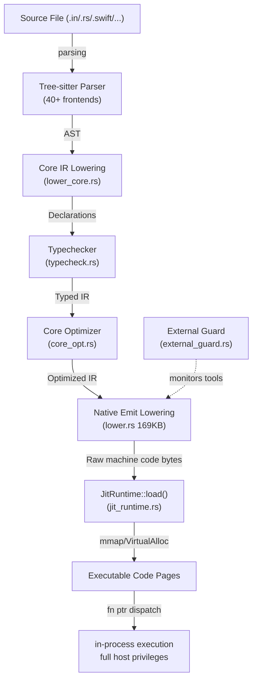
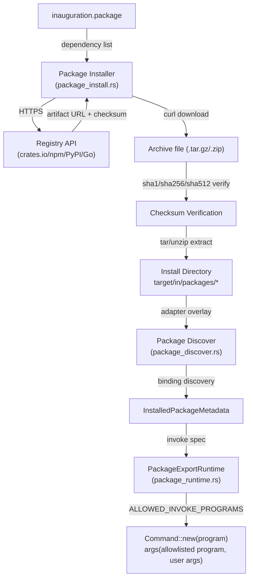
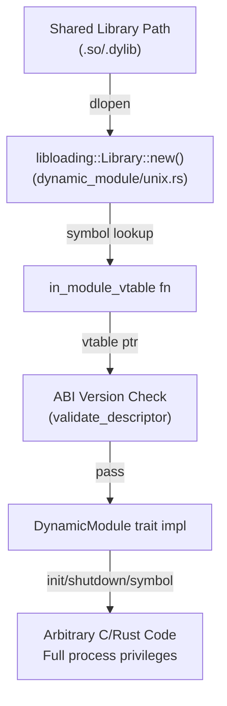
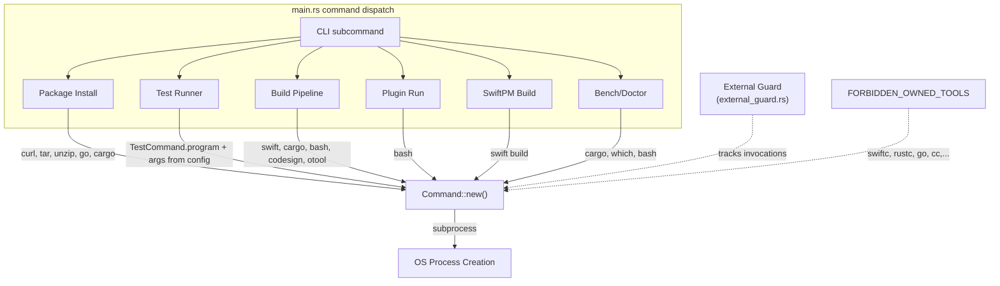

# Knowledge Base Report — Phase L2

Generated by piolium Phase L2 (Knowledge Base / Threat Model) — 2026-06-25T15:??:??Z
Mode: balanced
Target: `/Users/undivisible/projects/inauguration`
Commit: `3f9b59666c1e967e02f66a62996b3e2c58bf8af4`

---

## Project Classification

**Primary type**: Language compiler + CLI tool + package manager + JIT runtime + hot-reload daemon

Sub-types:
- **Library** (Core IR, typechecker, codegen, JIT, VM — exposed as the `inauguration` crate)
- **CLI tool** (`in` binary — compile, build, run, test, package, benchmark, graph, doctor, update, plugin)
- **Package manager** (`in add`, `in install`, `in lock` — multi-ecosystem: cargo, npm, PyPI, Go)
- **JIT runtime** (`in run` — Core IR → MIR → raw machine code → mmap → execute)
- **Hot-reload daemon** (`in preview` — AF_UNIX socket, file watcher, live reload protocol)
- **Protocol tool** (`protocol-gen` binary — protocol model generation)
- **Developer tooling server** (hybrid pipeline orchestration `compiler/rust-driver`)

**Primary languages**: Rust (121 files), supporting 40+ languages via Tree-sitter frontends.

**Build system**: Cargo workspace with `in-cli/Cargo.toml` as primary crate and `compiler/rust-driver/` as secondary workspace.

---

## Architecture Model

### Major Components

| Component | Location | Description | Language |
|-----------|----------|-------------|----------|
| **`in` CLI binary** | `in-cli/src/main.rs` (~4869 lines) | Main entrypoint. All subcommands (build, run, test, package, graph, bench, doctor, update, plugin, preview). | Rust |
| **Core Library** | `in-cli/src/lib.rs` | Re-exports of all internal modules. | Rust |
| **Parser Registry** | `in-cli/src/parser_registry.rs` | 40+ language frontends via Tree-sitter. Source → Core IR. | Rust |
| **Core IR** | `in-cli/src/core_ir.rs` | Intermediate representation for all frontends. | Rust |
| **Core IR Verifier** | `in-cli/src/core_ir_verifier.rs` | Validates Core IR correctness. | Rust |
| **Typechecker** | `in-cli/src/typecheck.rs`, `core_typecheck.rs`, `family_typecheck.rs` | Multi-pass type system. | Rust |
| **Core Optimizer** | `in-cli/src/core_opt.rs` | IR optimization passes. | Rust |
| **Lower to Core IR** | `in-cli/src/lower_core.rs` | Tree-sitter AST → Core IR lowering. | Rust |
| **Owned Compile Pipeline** | `in-cli/src/owned_compile.rs` | Orchestrates full compilation flow. | Rust |
| **JIT Runtime** | `in-cli/src/jit_runtime.rs` | **In-memory code execution**: mmap/VirtualAlloc, raw function pointers, `unsafe`. AArch64/x86-64. | Rust |
| **Native Emit** | `in-cli/src/native_emit/` | Machine code generation: AArch64, x86-64, ELF, Mach-O, COFF, WASM. 169KB `lower.rs`. | Rust |
| **Native Runtime** | `in-cli/src/native_runtime.rs` | Stdlib function bindings for bytecode VM (`NativeRuntime::standard()`). | Rust |
| **Bytecode VM** | `in-cli/src/vm.rs` | Stack-based bytecode interpreter. Package export invocation. | Rust |
| **Package Installer** | `in-cli/src/package_install.rs` | Registry resolve, download (curl), extract (tar/unzip), checksum verify. | Rust |
| **Package Runtime** | `in-cli/src/package_runtime.rs` | Invokes package exports with program allowlist. | Rust |
| **Package Discover** | `in-cli/src/package_discover.rs` | Adapter overlays, ecosystem-specific discovery. | Rust |
| **Package Lock/Manifest** | `in-cli/src/package_lock.rs`, `package_manifest.rs` | Dependency locking, manifest parsing. | Rust |
| **Dynamic Module Loader** | `in-cli/src/dynamic_module/` | `dlopen` plugin loading with ABI version checks. Unix + Windows. | Rust |
| **Hot Reload Daemon** | `in-cli/src/hotreload/daemon_impl.rs` | AF_UNIX socket, file watcher, patch emission, metrics. | Rust (tokio) |
| **Compile Cache** | `in-cli/src/compile_cache.rs` | FNV1a hash-based caching. Cache key includes source hash + compiler fingerprint. | Rust |
| **External Guard** | `in-cli/src/external_guard.rs` | Thread-local guard recording external tool invocations. Forbidden tool list (`swiftc`, `rustc`, etc.). | Rust |
| **Crate DB** | `in-cli/src/crate_db.rs` | In-memory module/crate/symbol database with `RwLock`. | Rust |
| **Cargo Linker** | `in-cli/src/cargo_linker.rs` | Cargo dependency resolution and module merging. | Rust |
| **Compile Scheduler** | `in-cli/src/compile_scheduler.rs` | Abstract compile backend (CPU, GPU placeholder). | Rust |
| **Language Gates** | `in-cli/src/language_gates.rs` | Feature verification per language support level. | Rust |
| **Hybrid Pipeline** | `compiler/rust-driver/` (7 crates) | Batch compiler orchestration: core, backend, passes, SIL, scheduler, pipeline, CLI. | Rust |
| **Compiler Driver** | `in-cli/src/compiler/driver.rs` | Pipeline orchestration for batch compilation. | Rust |
| **MIR Layer** | `in-cli/src/compiler/mir*.rs` | Machine IR between Core IR and native emit. | Rust |
| **Scripts** | `scripts/` | 42 shell scripts for validation, generation, install, CI. | Shell |

### Transports and Execution Environments

| Transport | Usage | Details |
|-----------|-------|---------|
| **stdin/stdout/stderr** | CLI I/O, test runner output | Synchronous |
| **Filesystem** | Source reading, build artifacts, package cache, lock files, metrics | Read/write to project-local paths |
| **HTTP/HTTPS** | Package registry downloads | crates.io, npmjs.org, PyPI, Go proxy. Via `curl` subprocess. |
| **AF_UNIX socket** | Hot-reload daemon ⇄ preview client | `/tmp/in-*.sock` or configurable path. Assumes same-machine. |
| **Dynamic library loading** | Plugin model | `dlopen` via `libloading`. Unix-only currently. |
| **Process spawning** | External tool execution | `std::process::Command` for curl, tar, unzip, cargo, go, bash, swift, which, cc, codesign, otool |
| **mmap / VirtualAlloc** | JIT code pages | Executable memory allocation. `MAP_JIT` on macOS. RW → RX transition. |
| **Shared memory** | Error page in JIT | Small RW page for throw/try/catch error flag. |

### Trust Boundaries

| ID | Boundary | Type | Crossing Data | Protocol | Security |
|----|----------|------|---------------|----------|----------|
| TB1 | User → CLI | Human-invoked | Source code, CLI args, manifests, env vars | stdin/args/fs | All input is developer-controlled. No auth layer. |
| TB2 | CLI → Package registries | Network | Package names, version specs, download requests | HTTPS (curl) | No mTLS, no certificate pinning. HTTPS-only enforced via `require_https()`. |
| TB3 | CLI → System shell | Process | Command args, file paths | Command invocation | Program-dependent; package_runtime has allowlist. |
| TB4 | CLI → JIT code | In-process | Raw machine code | mmap'd executable memory | Full host privileges. Unsafe. No sandbox. |
| TB5 | CLI → Dynamic modules | Process load | Shared libraries | dlopen | Full process privileges. ABI version check only. |
| TB6 | CLI → File system (cache) | Read/write | Cached compile reports | File I/O | FNV1a hash for integrity. No tamper resistance. |
| TB7 | Hot-reload daemon ↔ Preview client | IPC | Patch envelopes (NDJSON) | AF_UNIX socket | No authentication. File-based socket permissions. |
| TB8 | Foreign source files → Parser | File read | 40+ language source files | Filesystem | Tree-sitter parsers (C FFI). Complexity risk. |

---

## DFD/CFD Slices

### DFD Slice 1: JIT Compilation Pipeline (Highest Risk)



**Security-relevant properties**:
- `unsafe` in JitRuntime for mmap, function pointer call (`invoke()` via `blr`), Send/Sync impls for JitFunction/CodePage
- No W^X enforcement: macOS uses `MAP_JIT`, other platforms RW→RX transition after write
- Error page (writable, non-executable) accessible via X27 register during JIT calls
- `invoke()` writes crash debug info to `/tmp/jit_invoke.log` and `/tmp/jit_bad_addr.log` — world-readable debug artifact

### DFD Slice 2: Package Installation Flow (Supply Chain)



**Security-relevant properties**:
- `require_https()` enforces HTTPS for registry URLs
- Checksum verification uses SHA-1 (weak), SHA-256, SHA-512
- Go module checksum skips verification for `h1:` format (`// ponytail` comment)
- Package exports define `PackageInvokeSpec` with program+args — stored in installed metadata JSON
- `package_runtime.rs::ALLOWED_INVOKE_PROGRAMS` = `["echo", "node", "python3", "cargo", "go", "sh", "true"]`
- `package_discover.rs` generates binding specs with hardcoded invoke args per ecosystem (npm→node, pypi→python3, cargo→cargo, go→go)

### DFD Slice 3: Dynamic Module Loading



### CFD Slice 4: External Command Execution (Highest Risk Authz)



---

## Attack Surface

### Attacker-Controlled Inputs

| Input Vector | Entry Point | Trust Boundary | Risk Level | Evidence |
|-------------|-------------|----------------|------------|----------|
| **Source files** (.in, .rs, .swift, 40+ langs) | CLI `in build`, `in run`, `in test` | TB1 → Parser | 🟡 Medium | Tree-sitter C FFI, 40 parsers = large surface |
| **Package manifests** (inauguration.package, .lock) | CLI `in install`, `in add` | TB1 → Manifest parser | 🟡 Medium | YAML-like parsing, version specifiers |
| **CLI arguments** | All subcommands | TB1 → clap parser | 🟢 Low | clap validates input |
| **Registry responses** | Package install | TB2 → curl → JSON parse | 🟠 Medium | MITM, compromised registry, cache poisoning |
| **Package archive contents** | Extraction | TB3 (tar/unzip) → fs | 🟠 Medium | Zip slip, path traversal via archive |
| **Package metadata JSON** | Installed metadata read | TB3 → serde_json | 🟠 Medium | PackageExportBinding.invoke defines program+args |
| **Dynamic library files** | in plugin, dlopen | TB5 → libloading | 🔴 High | Arbitrary code execution |
| **JIT code bytes** | Generated by compiler | TB4 → mmap → exec | 🔴 High | Code generation bug → memory corruption |
| **Hot-reload socket clients** | AF_UNIX | TB7 | 🟡 Medium | No auth, local-only |
| **Environment variables (IN_\*)** | Compiler initialization | TB1 → code paths | 🟢 Low | Configuration override |
| **Test command specs** | in test config | TB1 → Command::new | 🟠 Medium | TestCommand.program + args |
| **Plugin install/running** | in plugin | TB3 → bash | 🟠 Medium | Shell script execution |

### Framework Contracts and Hidden Control Channels

#### Environment Variable Control Channels

| Variable | Effect | File | Security Impact |
|----------|--------|------|-----------------|
| `IN_PARSER=in\|icore` | Force Core IR front for any file | `parser_registry.rs:341` | Skips language detection — could cause misparse |
| `IN_TYPECHECK=strict` | Enable strict typecheck mode | `bytecode_compiler.rs:34`, `owned_compile.rs:417` | Changes semantic analysis rigor |
| `IN_NATIVE_SWIFT_SIL` | Control Swift SIL pipeline | `main.rs:723` | Bypasses external toolchain guard |
| `IN_SIL_CALLEE_DRIVEN_HOTRELOAD=1` | Enable callee-driven hot reload | `hotreload/daemon_impl.rs:296` | Changes patch planning behavior |
| `IN_INSTALL_DIR` | Override install root for in update | `main.rs:3359` | Controls where `cargo install --root` places binary |
| `IN_REPO` | Override GitHub repo slug for remote install | `main.rs:3380` | Controls URL for install.sh fetch |
| `HOME` | Plugin install dir resolution | `main.rs:3496` | Plugin home directory |

#### Proxy/Transport Assumptions

- **HTTPS enforcement**: `require_https()` in `package_install.rs:810` rejects non-`https://` URLs
- **No mTLS**: Registry fetches use plain curl with no client certificate
- **No certificate pinning**: Trusts system CA store via curl
- **`User-Agent`**: Hardcoded `inauguration/0.2.0 (package-install)` via `REGISTRY_USER_AGENT`

#### Middleware-like Patterns (Rust-level)

- **External Guard** (`external_guard.rs`): Thread-local guard that records external tool invocations. `FORBIDDEN_OWNED_TOOLS` list blocks certain compiler invocations.
- **No web middleware**: Not a web application — no HTTP middleware stack.
- **No rate limiting**: None implemented.
- **No authentication/authorization layer**: CLI assumed single-user; no multi-tenant isolation.
- **Compile Cache** (`compile_cache.rs`): Caches compile results keyed by FNV1a(source_path + source_content + compiler_build_fingerprint). Cache located at `target/in/cache/<hash>/metadata.json`. No integrity protection beyond hash.
- **Cargo Metadata Cache** (`cargo_linker.rs`): 5-minute TTL cache of `cargo metadata` output in `Mutex<HashMap>`. Stale data risk.

#### IPC Contracts

- **Hot-reload protocol**: AF_UNIX socket, NDJSON envelopes with `PatchEnvelope` schema. `protocol_version: u8` field checked (must be 1). No auth, no encryption.
  - Socket path: configurable via `DaemonConfig.socket_path`
  - Metrics file: NDJSON at configurable path, appended per event
- **Preview client**: `preview_client.rs` reads from Unix socket, validates NDJSON, drops lines with unsupported protocol_version

#### Runtime Mode Differences

- **JIT mode** (`CompileTarget::Jit`): In-memory, no artifact on disk. Uses `JitRuntime::load()` + `invoke()`.
- **Native mode** (`CompileTarget::Native`): Writes ELF/Mach-O/COFF to disk. Invokes codesign+otool for Mach-O.
- **Bytecode mode** (`CompileTarget::Bytecode`): Stack VM execution via `BytecodeVM::run()`.
- **Hot reload daemon** vs CLI: Daemon uses tokio async runtime with file watcher (`notify`). CLI is synchronous.

#### ABI Contract (Dynamic Modules)

```rust
pub const IN_MODULE_ENTRY_SYMBOL: &str = "in_module_vtable";
pub const IN_ABI_VERSION: u32 = 1;
```

Dynamic modules must export an `in_module_vtable` function returning a `*const RawModuleVTable` with:
- `abi_version`, `pointer_width`, `endian`, `layout_hash`
- Optional: `alloc`, `dealloc`, `init`, `shutdown`, `symbol`, `manifest` function pointers

Validation checks only `abi_version == IN_ABI_VERSION`. No `pointer_width`/`endian`/`layout_hash` validation in `validate_descriptor()`.

---

## Key Dependencies

Seeded from Phase 1 advisory summary (no `sbom.json` found). Security-relevant subset:

| Package | Version | Ecosystem | Purpose | Security Relevance | Advisory History |
|---------|---------|-----------|---------|-------------------|-----------------|
| **tokio** | 1.52.3 | crates.io | Async runtime (hotreload daemon) | ✅ Network IPC, async fs | 5 advisories (all patched) |
| **clap** | 4.x | crates.io | CLI argument parsing | 🟢 Well-audited | None |
| **serde** | 1.0.228 | crates.io | Serialization | ✅ Deserialization surface | None known |
| **serde_json** | 1.x | crates.io | JSON parsing | ✅ Parser bugs | None known |
| **tree-sitter** | 0.26.9 | crates.io | Parser framework | ✅ C FFI via bindings | None known |
| **tree-sitter-{lang}** | various | crates.io | Language grammars | ✅ 39 language parsers | None known for Rust bindings |
| **blake3** | 1.x | crates.io | Cryptographic hashing | ✅ Integrity verification | None |
| **sha1** | 0.11.x | crates.io | SHA-1 hashing | ⚠️ Weak hash algorithm | None recent |
| **sha2** | 0.11.0 | crates.io | SHA-256 hashing | ✅ Crypto implementation | 1 advisory (patched) |
| **base64** | 0.22.1 | crates.io | Base64 encoding | ✅ Encoding/decoding | 1 critical advisory (patched) |
| **libloading** | 0.9.0 | crates.io | Dynamic library loading | 🔴 RCE vector | None |
| **notify** | 8.2.0 | crates.io | File system watcher | 🟢 File events only | None |
| **libc** | 0.2.x | crates.io | C FFI bindings | ✅ System-level FFI | None |
| **parking_lot** | 0.12.x | crates.io | Synchronization | ✅ Locking behavior | None |
| **tracing** | 0.1.44 | crates.io | Instrumentation | 🟢 Observability only | 1 advisory (patched) |
| **rayon** | latest | crates.io | Parallel iteration | 🟢 Data parallelism | None |
| **thiserror** | latest | crates.io | Error derive macros | 🟢 Build-time only | None |

### Reachability Notes

- **libloading** is reachable only when loading dynamic modules from `dynamic_module/unix.rs`. Not invoked on normal compilation paths. Supply-chain risk if an attacker can place a malicious `.dylib`/`.so`.
- **sha1** is used for npm registry SHA-1 checksums. Collision attacks against SHA-1 could allow archive substitution.
- **tokio** is only used in the hot-reload daemon (`hotreload/daemon_impl.rs`). Not reachable via standard CLI compile paths.
- **tree-sitter** parsers are C code via FFI. Parser bugs in grammar files can cause memory corruption/DoS.

---

## Framework Contracts and Hidden Control Channels

(Consolidated section enumerating all contracts the security model depends on.)

### 1. Environment Variable Contracts

| Variable | Default | Effect on Security | Path |
|----------|---------|--------------------|------|
| `IN_PARSER` | unset (auto-detect) | Changes which frontend parses input — can force `.in` parser on non-`.in` files | `parser_registry.rs` |
| `IN_TYPECHECK` | unset (normal) | `strict` enables stricter typechecking — affects which programs compile | `bytecode_compiler.rs`, `owned_compile.rs` |
| `IN_NATIVE_SWIFT_SIL` | unset | Controls Swift SIL pipeline bypassing external toolchain guard | `main.rs:723` |
| `IN_SIL_CALLEE_DRIVEN_HOTRELOAD` | unset | Changes hot-reload patch planning strategy | `hotreload/daemon_impl.rs:296` |
| `IN_INSTALL_DIR` | unset | Controls `cargo install --root` target for `in update` | `main.rs:3359` |
| `IN_REPO` | `semitechnological/inauguration` | Controls remote install script URL | `main.rs:3380` |

### 2. File System Contract Assumptions

- **Cache directory**: `target/in/cache/<fnv1a-hash>/metadata.json`. Cache key includes source path+content hash + compiler binary modification time+size. FNV1a is non-cryptographic — hash collision is feasible.
- **Package install directory**: `target/in/packages/<ecosystem>/<name>/<version>/`. Metadata at `inauguration.package.json`.
- **Adapter files**: `inauguration.adapter.json` in install directories defines `PackageInvokeSpec` bindings.
- **Lock file**: `inauguration.lock` at project root.
- **Metrics NDJSON**: `.brisk/hotreload/metrics/latest.ndjson` (default).
- **JIT debug logs**: `/tmp/jit_invoke.log`, `/tmp/jit_bad_addr.log`.

### 3. ABI Contract (Plugin / Dynamic Module Interface)

- Entry symbol: `in_module_vtable` returning `*const RawModuleVTable`
- ABI version: `1` (constant `IN_ABI_VERSION`)
- Only `abi_version` field validated — layout hash, pointer width, endian are **not** validated at runtime
- Function pointers via vtable: `alloc`, `dealloc`, `init`, `shutdown`, `symbol`, `manifest` (all `Option`)

### 4. Hot-Reload IPC Contract

- Transport: AF_UNIX socket
- Format: Newline-delimited JSON (NDJSON)
- Schema: `PatchEnvelope` with `protocol_version: 1`, `patch_id`, `timestamp_ms`, `patch` (`target`, `patch_type`, `compatible`), `reload_decision`, `reason`
- No authentication. No encryption. File permissions control access.
- Metrics: NDJSON file write per event.

### 5. Package Invocation Contract

- `PackageExportBinding.invoke` stored in `inauguration.package.json`
- `ALLOWED_INVOKE_PROGRAMS` = `["echo", "node", "python3", "cargo", "go", "sh", "true"]`
- `run_invoke()` validates program against allowlist, but args are passed verbatim from stored metadata
- Program runs in install directory as `current_dir`

### 6. Security Decisions Made Outside Handler-Level Checks

- **External tool forbidden list** (`FORBIDDEN_OWNED_TOOLS` in `external_guard.rs`): Blocks `swiftc`, `rustc`, `go`, `cc`, `clang`, etc. This is a guard, not an enforcement — it only records invocations, it does not prevent them.
- **Swift external toolchain guard** in `main.rs`: Checks `IN_NATIVE_SWIFT_SIL` env var before deciding whether to accept `.swift`/`.swiftpm` paths. This is the only place the guard is checked — no handler re-check.
- **Compile cache** uses FNV1a + compiler binary fingerprint. Cache poisoning possible if attacker controls source path+content or compiler binary modification time.

### 7. No auth, session, or tenant infrastructure

This is a CLI tool. There is no authentication, authorization, session handling, or multi-tenancy at any level.

---

## Domain Attack Research

### Mode B — Library-as-Consumer

#### Crypto/Hashing Dependencies

| Dependency | Usage | Sharp Edge | Risk |
|------------|-------|------------|------|
| **sha1** | Checksum verification for npm tarballs | SHA-1 collision resistance broken (SHAttered, SHAMBles). Collision could allow archive substitution. | Medium |
| **sha2** | Checksum verification for crates.io, PyPI | Well-audited, no known weaknesses at current security levels. | Low |
| **sha512 (via sha2)** | npm integrity verification | Sound. | Low |
| **blake3** | Not used in checksum paths currently | — | Low |
| **fnv1a** | Compile cache key | **Non-cryptographic** — collision feasible. Cache poisoning attack surface. | Medium |

#### Serialization/Deserialization

| Component | Library | Attack Surface |
|-----------|---------|---------------|
| Package metadata | serde_json from installed metadata files | `InstalledPackageMetadata` — controls `PackageInvokeSpec` (program + args). If attacker can modify `inauguration.package.json`, they control subprocess execution. |
| Registry API responses | serde_json from HTTPS | All registry API responses are parsed from potentially compromised registries. Large JSON payload processing. |
| Lock/manifest | serde_yaml/serde_json | Dependency version specifiers. |
| Hot-reload envelopes | serde_json | IPC channel. |

#### Subprocess Execution

**Sharpest edge**: `std::process::Command` used extensively across 10+ files with various levels of input validation:

| File | Called Program | Input Source | Validation |
|------|---------------|-------------|------------|
| `package_install.rs` | curl, tar, unzip, go | URLs, file paths, archive paths | `require_https()` for URLs; paths from constructed values |
| `main.rs` | swift, bash, cargo, which | CLI args, config, discovered paths | None (developer tool) |
| `package_runtime.rs` | node, python3, cargo, go, sh, echo | Package metadata (JSON) | Program allowlist; args passed verbatim |
| `package_discover.rs` | go, python3, cargo | Discovered package paths | None (adapter overlay) |
| `cargo_linker.rs` | cargo | Project directory | None |
| `external_guard.rs` | Recording only | Any | Not an enforcement — tracking only |
| `native_emit/lower.rs` | codesign, /bin/sh, otool | Binary paths | Native code signing |

#### Dynamic Code Evaluation

| Location | Mechanism | Risk |
|----------|-----------|------|
| `jit_runtime.rs` | In-memory JIT code execution | **Highest risk** — raw machine code from compile pipeline executed in-process |
| `dynamic_module/unix.rs` | dlopen plugin loading | **High risk** — arbitrary shared libraries loaded with full process privileges |
| `package_runtime.rs` | sh, node, python3, go via Command | **Medium risk** — subprocess execution with full OS privileges |

### Mode C — Domain-Specific Attack Research

#### JIT / Native Code Generation Domain

| Attack Class | Relevance | SAST Targets |
|-------------|-----------|-------------|
| Code generation bugs → memory corruption | 🔴 High — `native_emit/lower.rs` (169KB) generates AArch64/x86 machine code | `lower.rs`, `x86_64_lower.rs`, `aarch64.rs` |
| Executable memory management | 🔴 High — mmap/VirtualAlloc with RWX or RW→RX pages | `jit_runtime.rs` |
| Function pointer dispatch | 🔴 High — unsafe blr calls via inline asm | `jit_runtime.rs:invoke()` |
| ICache coherency | 🔴 High — `sys_icache_invalidate` on macOS, `__clear_cache` on Linux ARM | `jit_runtime.rs` |
| Code page reuse after free | Medium — pages freed in `Drop`; no reference counting | `jit_runtime.rs` |
| Error page (X27) misuse | Medium — writable page pointer passed to JIT code | `jit_runtime.rs:invoke()` |

#### Package Manager / Supply Chain Domain

| Attack Class | Relevance | SAST Targets |
|-------------|-----------|-------------|
| Dependency confusion | 🟠 Medium — multi-ecosystem (cargo, npm, PyPI, Go) allows confusion between e.g. private npm vs public PyPI | `package_ref.rs` |
| Archive extraction (Zip Slip) | 🟠 Medium — `tar` with `--strip-components=1`, `unzip` without path validation | `package_install.rs:fetch_and_extract` |
| Registry MITM | 🟠 Medium — HTTPS-only enforced but no certificate pinning | `package_install.rs:require_https` |
| Checksum bypass (Go modules) | 🟠 Medium — Go module sum `h1:` prefix skips actual verification | `package_install.rs:verify_archive_checksum` |
| SHA-1 collision | 🟡 Low-Medium — npm uses SHA-1 for some integrity checks | `package_install.rs` |
| Cache poisoning | 🟡 Low — compile cache uses FNV1a (non-crypto) | `compile_cache.rs` |

#### Command Injection Domain

| Attack Class | Relevance | SAST Targets |
|-------------|-----------|-------------|
| Via package metadata | 🟠 Medium — `PackageExportBinding.invoke.args` passed to `Command::new()` | `package_runtime.rs`, `package_discover.rs` |
| Via test config | 🟠 Medium — `TestCommand.program` + `args` | `main.rs:run_test_group` |
| Via environment variables | 🟢 Low — `IN_REPO` used in URL construction for curl, validated | `main.rs` |
| Via plugin running | 🟢 Low — plugin script paths are fixed | `main.rs:cmd_plugin` |

#### Dynamic Code Loading Domain

| Attack Class | Relevance | SAST Targets |
|-------------|-----------|-------------|
| DLL hijacking | 🟠 Medium — `libloading::Library::new(path)` with controlled path | `dynamic_module/unix.rs` |
| ABI mismatch | 🟡 Low — version checked, but pointer_width/endian/layout unchecked | `dynamic_module/mod.rs` |
| Missing bounds checks | 🟠 Medium — vtable function pointers called unchecked if `Some` | `dynamic_module/unix.rs` |

#### Parser / Deserialization Domain

| Attack Class | Relevance | SAST Targets |
|-------------|-----------|-------------|
| Tree-sitter parser bugs | 🟠 Medium — 40+ C parsers via FFI | All parser files |
| Large input DoS | 🟡 Low — Tree-sitter has O(n) worst-case timeout | `parser_registry.rs` |
| JSON DoS (deep nesting) | 🟡 Low — serde_json may blow stack on deeply nested objects | Registry response parsing |

#### Custom SAST Targets

Based on domain analysis, the following CodeQL/path patterns should be added to custom SAST:

1. **Command injection via package bindings**: Track `PackageExportBinding.invoke.args` → `Command::new().args()` flow
2. **JIT code page lifecycle**: Track `CodePage` allocation → write → `make_executable` → function pointer call
3. **Unsafe Send/Sync on raw pointers**: All `unsafe impl Send/Sync` for pointer-containing structs
4. **Non-cryptographic hash for security**: FNV1a usage in `compile_cache.rs`
5. **Archive path traversal**: `tar`/`unzip` extraction without path validation
6. **Thread-local guard bypass**: `ExternalInvocationGuard` can be bypassed if `enter()` is not called before `record()`

#### Manual Review Checklist

- [ ] JIT runtime: verify all `unsafe` blocks have SAFETY comments and are sound
- [ ] JIT runtime: verify `invoke()` function pointer call (`blr` inline asm) — does it handle all argument counts safely?
- [ ] JIT runtime: check `CodePage::drop` is called at correct times — is there use-after-free risk?
- [ ] Native emit `lower.rs`: check codegen for buffer overflow, integer overflow, alignment
- [ ] Dynamic module: verify `validate_descriptor()` is called before any vtable dispatch
- [ ] Package allowlist: verify `ALLOWED_INVOKE_PROGRAMS` cannot be bypassed via path traversal (e.g. `../../bin/sh`)
- [ ] Package installer: verify tar extract flags don't allow path traversal (`--strip-components=1` reduces but doesn't eliminate risk)
- [ ] Compile cache: verify FNV1a collision does not lead to wrong compile result reuse
- [ ] Hot-reload daemon: verify socket file permissions are set correctly (non-world-writable)
- [ ] Go module checksum: verify h1: prefix skip is intentional and documented
- [ ] Cross-ecosystem dependency confusion: verify namespace isolation between cargo/npm/PyPI/Go

---

## Threat Model

### Scope and Assumptions

- **In-scope**: Full source tree at `/Users/undivisible/projects/inauguration`
- **Out-of-scope**: External third-party dependencies (beyond their advisory status), Tree-sitter grammar source files (vendor C code), runtime kernel interactions
- **Deployment model**: CLI tool installed locally via Homebrew (wax install), `cargo install`, or source build. Single-user workstation.
- **Internet exposure**: None directly. CLI initiates outbound HTTPS to package registries during `in install`/`in add`.
- **Attacker model**: Local user (multi-user system, untrusted shared machine) OR remote attacker who can influence input files (supply chain through malicious packages, malicious source files). Developer machine is the trust root.
- **Data sensitivity**: Source code, build artifacts, package dependencies. No credentials/PII handled except what the developer's own code processes.
- **Authn/authz expectations**: None. CLI runs with user privileges. No multi-tenancy.

### Assets

| Asset | Why It Matters | Security Objective (C/I/A) |
|-------|---------------|---------------------------|
| **JIT code pages** | Executable memory in process — corruption leads to RCE | Integrity (I) |
| **Installed package metadata** | Defines `PackageInvokeSpec` — controls subprocess execution | Integrity (I) |
| **Source code being compiled** | Trustworthiness of compilation output | Integrity (I) |
| **Compile cache** | FNV1a hash — cache poisoning could serve wrong artifacts | Integrity (I) |
| **Build artifacts** (ELF/Mach-O) | Binary output integrity | Integrity (I) |
| **Package download archives** | Execution after extraction — supply chain risk | Integrity (I), Confidentiality (C) |
| **Hot-reload socket** | IPC channel — socket poisoning could inject fake patches | Integrity (I) |
| **JIT debug logs** (/tmp/\*.log) | Sensitive address information disclosure | Confidentiality (C) — low |

### Attacker Model

#### Capabilities
1. **Supply chain attacker**: Can register malicious packages on crates.io, npm, PyPI, or Go proxy. Can compromise a registry account.
2. **Local attacker**: Has user-level access on the same machine. Can write to `/tmp/`, observe processes, connect to AF_UNIX sockets.
3. **Source file attacker**: Can craft malicious source files in any of 40+ languages. Can craft malicious manifest/adapter files.
4. **MITM (network)**: Can intercept registry traffic if HTTPS is bypassed or a CA is compromised.

#### Non-capabilities
1. Cannot escalate to root without a separate privilege escalation vulnerability.
2. Cannot bypass `require_https()` enforcement in code (unless binary is modified).
3. Cannot load dynamic modules without user action (`in plugin install`) or explicit API call.
4. Cannot override the program allowlist in `package_runtime.rs` without modifying installed metadata.

### Top Abuse Paths

1. **Malicious package → command execution**: Attacker publishes package on npm/PyPI. Package includes `inauguration.adapter.json` with `PackageInvokeSpec` pointing to `sh` with malicious args. Developer runs `in install` then compiles code importing the package. `package_runtime.rs` allows `sh` in program allowlist.

2. **Malicious source file → JIT code execution**: Attacker provides `.in` file with crafted code that triggers a codegen bug in `lower.rs` or `x86_64_lower.rs`. Generated machine code contains attacker-controlled bytes. JIT maps into executable memory and calls through function pointer.

3. **Cache poisoning → compile result substitution**: Attacker writes to `target/in/cache/<hash>/metadata.json` with manipulated compile report. FNV1a collision feasible. Developer unknowingly uses cached results from poisoned entry.

4. **Dynamic module ABI bypass**: Attacker places malicious `.dylib`/`.so` with `in_module_vtable` entry. Module passes ABI version check (1). All vtable function pointers execute with full process privileges. No validation beyond ABI version.

5. **Registry MITM → arbitrary archive extraction**: Attacker intercepts HTTPS to registry (compromised CA). Returns malicious archive with path traversal entries. `tar -xf --strip-components=1` doesn't prevent `../` paths in archive.

6. **Hot-reload socket poisoning**: Local attacker connects to daemon's AF_UNIX socket. Sends crafted NDJSON envelopes. No auth required. Could cause patch misclassification.

### Threat Model Table

| ID | Threat Source | Prerequisites | Threat Action | Impact | Assets | Existing Controls | Gaps | Recommended Mitigations | Detection | Likelihood | Impact | Priority |
|----|--------------|---------------|---------------|--------|--------|-------------------|------|------------------------|-----------|------------|--------|----------|
| TM-001 | Malicious package registry | Attacker publishes package with crafted adapter JSON | PackageExportBinding defines program: "sh", args: -c ... | Arbitrary command execution at user privilege | Package metadata, OS | ALLOWED_INVOKE_PROGRAMS allowlist; require_https() for downloads | sh is in allowlist; args are not validated | Remove sh from allowlist; validate args against schema; use fixed-function wrappers | Compare adapter hashes against registry provenance | Medium | High | **High** |
| TM-002 | Malicious source file | Attacker supplies crafted .in/.rs/.swift file | Codegen bug produces malformed machine code | In-process code execution | JIT code pages, compiler output | core_ir_verifier.rs validates IR; typechecker catches type errors | No codegen-level validation; no sandbox around JIT | Add codegen verifier; run JIT in separate process/W^X; fuzz native_emit/lower.rs | Monitor jit_invoke.log for crashes | Low | Critical | **High** |
| TM-003 | Cache poisoning | Write access to target/in/cache/ | Replace metadata.json with forged compile report | Wrong compile results reused | Compile cache | FNV1a hash includes source path+content + compiler fingerprint (mod time+size) | FNV1a is non-cryptographic; no signature on cache entries | Use SHA-256 for cache keys; sign cache metadata; use read-only cache directory | Monitor cache directory integrity | Medium | Medium | **Medium** |
| TM-004 | Dynamic module hijacking | Attacker places malicious .dylib/.so in plugin path | dlopen loads module with in_module_vtable; vtable dispatch runs arbitrary code | Full process RCE | Process memory | ABI version check (==1); only loaded via explicit plugin commands | No code signing; no path validation; no pointer_width/endian checks | Add code signing requirement; validate pointer_width/endian; sandbox plugin loading in isolate process | Audit loaded modules | Low | Critical | **High** |
| TM-005 | Registry MITM | Attacker controls network path (compromised CA/wifi) | Modified archive downloaded; checksum verification passes if attacker controls registry response | Malicious files extracted to install directory | Package archives, install directory | require_https() enforcement | No certificate pinning; no certificate transparency | Add certificate pinning; use checksum from separate channel; support private registries with explicit fingerprints | — | Low | High | **Medium** |
| TM-006 | Archive path traversal | Attacker publishes malicious archive with ../ entries | tar -xf with --strip-components=1 mitigates some but not all path traversal | Files written outside install directory | Filesystem | --strip-components=1 limits but doesn't eliminate traversal | No explicit path validation after extraction | Validate all extracted paths are within install directory; use safe extraction library | — | Medium | Medium | **Medium** |
| TM-007 | Go module checksum bypass | Go module with h1: checksum prefix | verify_archive_checksum() skips verification for h1: hash | Unverified archive extracted/modified | Go package installs | // ponytail comment notes Go canonicalization | No actual checksum verification for Go modules | Implement h1: hash verification; or verify via go mod verify after extraction | — | Low | Medium | **Low** |
| TM-008 | JIT debug log info disclosure | Local user can read /tmp/jit_\*.log | JIT invoke logs contain code page base address and entry address | ASLR bypass for local exploit | JIT layout information | None | No access control on /tmp log files | Remove debug file writes in release builds; or use secure logging | — | High | Low | **Low** |
| TM-009 | Hot-reload socket auth bypass | Local attacker connects to AF_UNIX socket | Sends crafted PatchEnvelope NDJSON | Client receives false patch info | Preview client IPC | protocol_version field validated (must be 1) | No authentication; no authorization | Add authentication token; use peer credentials (SO_PEERCRED) | Monitor socket access | Medium | Low | **Low** |
| TM-010 | External Guard bypass | Code path calls Command::new() without ExternalInvocationGuard::enter() | External tool invoked without being tracked | Audit blind spot for external tool invocations | External tool audit log | Thread-local guard pattern | Guard is opt-in — not all Command::new() call sites use it | Make ExternalInvocationGuard permanent (always recording); add automatic wrapping | — | Medium | Low | **Low** |

### Criticality Calibration

For this project (CLI compiler tool, single-user, not network-facing):

| Level | Definition | Examples |
|-------|-----------|---------|
| **Critical** | Arbitrary code execution from untrusted input with no developer action beyond compilation | TM-002 (codegen bug), TM-004 (dlopen hijack) |
| **High** | Arbitrary command execution via subprocess; substantial integrity compromise | TM-001 (package command injection) |
| **Medium** | Cache poisoning, archive path traversal, local information disclosure | TM-003, TM-005, TM-006 |
| **Low** | Audit bypass, unverified checksums, socket without auth | TM-007, TM-008, TM-009, TM-010 |

### Focus Paths for Security Review

| Path | Why It Matters | Related Threat IDs |
|------|---------------|-------------------|
| `in-cli/src/jit_runtime.rs` | JIT code execution — unsafe, mmap, function pointer dispatch | TM-002, TM-008 |
| `in-cli/src/native_emit/lower.rs` | Machine code generation — largest single file (169KB), codegen bugs → memory corruption | TM-002 |
| `in-cli/src/native_emit/x86_64_lower.rs` | x86-64 codegen — complexity, register allocation, instruction encoding | TM-002 |
| `in-cli/src/package_runtime.rs` | Command execution allowlist — controls subprocess from package exports | TM-001 |
| `in-cli/src/package_install.rs` | Registry fetch, checksum verification, archive extraction — supply chain surface | TM-005, TM-006, TM-007 |
| `in-cli/src/package_discover.rs` | Adapter discovery — generates PackageInvokeSpec from ecosystem layout | TM-001 |
| `in-cli/src/dynamic_module/unix.rs` | dlopen plugin loading — ABI contract, vtable dispatch | TM-004 |
| `in-cli/src/compile_cache.rs` | Cache key derivation — FNV1a hash, cache poisoning | TM-003 |
| `in-cli/src/external_guard.rs` | Tool invocation guard — thread-local, opt-in | TM-010 |
| `in-cli/src/hotreload/daemon_impl.rs` | AF_UNIX socket server — no auth, no encryption | TM-009 |

---

## Phase 4 CodeQL Extraction Targets

### High-Risk DFD Slices with Expected Source/Sink

| DFD Slice | Source Type | Sink Kind | CodeQL Query Target |
|-----------|-------------|-----------|---------------------|
| PackageInstall → Command Execution | LocalUserInput (CLI args, package files) → RemoteFlowSource (registry API) | command-execution | package_install.rs curl, tar, unzip, go calls |
| PackageRuntime → Subprocess | LocalUserInput (package metadata JSON, adapter files) | command-execution | package_runtime.rs:run_invoke → Command::new(spec.program) |
| JIT Runtime → Code Execution | EnvironmentVariable (source code content through pipeline) | code-execution | jit_runtime.rs:invoke() inline asm blr |
| Dynamic Module → Library Loading | LocalUserInput (plugin path via CLI) | code-execution | dynamic_module/unix.rs:libloading::Library::new(path) |
| Compile Cache → File Access | LocalUserInput (source path+content) | file-access | compile_cache.rs cache read/write |
| Native Emit → File Write | LocalUserInput (source code) | file-access | native_emit/lower.rs codesign, otool, sh calls |
| main.rs → Command Execution | LocalUserInput (CLI args, test config) | command-execution | main.rs swift, bash, cargo, which calls |
| Cargo Linker → Command Execution | LocalUserInput (project directory) | command-execution | cargo_linker.rs cargo metadata calls |

### Additional Query Targets

| Sink Pattern | Files | Notes |
|-------------|-------|-------|
| std::fs::read_to_string (untrusted path) | native_runtime.rs, various | User-provided paths |
| serde_json::from_str (untrusted input) | package_install.rs, package_discover.rs, hotreload/ | Registry responses, adapter JSON |
| std::ptr::copy_nonoverlapping | jit_runtime.rs | Code page write |
| libc::mmap / VirtualAlloc | jit_runtime.rs | Executable memory allocation |
| unsafe impl Send/Sync for pointer types | jit_runtime.rs, native_emit/native_link.rs | Soundness of Send/Sync on raw pointers |

---

## Spec Gap Candidates

The project does not implement any external RFCs or formal specifications as a compliance requirement. However, the following informal contracts exist:

| Contract | Type | Location | Gap Risk |
|----------|------|----------|----------|
| Hot-reload IPC protocol | Informal protocol | hotreload/generated_protocol.rs, daemon_impl.rs | Protocol described in code only — no external spec to verify against |
| Dynamic module ABI | Binary interface contract | dynamic_module/mod.rs (ABI version 1) | Only abi_version validated; no formal ABI documentation |
| Package adapter format | JSON schema (implicit) | package_discover.rs (inauguration.adapter.json) | No schema document — schema defined by Rust structs |
| Installed package metadata | JSON schema (implicit) | package_install.rs (InstalledPackageMetadata) | No schema document |
| Compile cache format | Internal cache structure | compile_cache.rs (schema_version 1) | No external stability guarantee |
| Core IR | Internal IR specification | core_ir.rs | Documented in docs/architecture/ but no formal spec |
| Boundary IR | Internal ABI | boundary_ir.rs | ABI version tracked, no formal specification |

### Known Spec/Compliance Gaps

- **No SECURITY.md**: No vulnerability disclosure process documented
- **No CHANGELOG.md**: No changelog for security fix tracking
- **No SBOM**: No software bill of materials (beyond cargo deny / lock file)
- **No formal supply-chain attestation**: No signing of releases or inauguration.lock files

---

## Coverage Gaps

| Gap | Description |
|-----|-------------|
| **No sbom.json found** | Phase 1 mentions sbom.json should exist — it was not created. Full component inventory had to be derived from source exploration. |
| **Tree-sitter grammar C code** | All 39+ language grammars are vendored native code. Each grammar is a potential exploit surface. No C-specific SAST coverage. |
| **conformance/ test suite** | 54 conformance tests exist but security-specific test cases (malformed input, large input, edge-case codegen) are not present. |
| **Fuzzing** | No evidence of fuzzing harnesses for parser or codegen. |
| **Dynamic analysis** | No sanitizer builds, no ASAN/MSAN/TSAN configurations found. |
| **No manual penetration test history** | No previous security assessment findings. |

---

*End of Knowledge Base Report — Phase L2 complete.*

---

## Static Analysis Summary

Generated by piolium Phase L3 (SAST) — 2026-06-25T05:18:16.612Z
Mode: balanced (fallback: grep+read)

### Execution

- **CodeQL**: Not on PATH — skipped
- **Semgrep**: Not on PATH — skipped
- **FALLBACK**: grep+read pattern analysis executed

### Sub-step 4.1 — Structural Extraction Results

| Metric | Count |
|--------|-------|
| Entry points identified | 12 |
| Sinks identified | 7 categories across 12+ files |
| Reachable call-graph slices | 9 |
| High-risk files analyzed | 12 (jit_runtime, package_runtime, package_install, package_discover, compile_cache, dynamic_module, external_guard, main, parser_registry, hotreload/daemon_impl, cargo_linker, native_emit/lower) |

### Built-in Tooling Coverage

No CodeQL or Semgrep suites were run — neither tool was found on $PATH.

### Custom Artifacts Created

| Artifact | Path | Description |
|----------|------|-------------|
| Semgrep rule | `piolium/semgrep-rules/command-injection-package-runtime.yaml` | Command injection via package allowlist |
| Semgrep rule | `piolium/semgrep-rules/hidden-control-channels-env-vars.yaml` | 6 env var control channel rules |
| Semgrep rule | `piolium/semgrep-rules/archive-extraction-path-traversal.yaml` | Tar/unzip path traversal + Go checksum bypass |
| Semgrep rule | `piolium/semgrep-rules/jit-unsafe-patterns.yaml` | JIT Send/Sync, RWX pages, debug log leaks |
| Semgrep rule | `piolium/semgrep-rules/adapter-overlay-package-override.yaml` | Adapter overlay & FNV1a cache hash |
| CodeQL query | `piolium/codeql-queries/command-injection-package-runtime.ql` | Command injection flow from adapter JSON to Command |
| CodeQL query | `piolium/codeql-queries/env-var-control-channel-bypass.ql` | IN_ env var control channel detection |
| CodeQL query | `piolium/codeql-queries/jit-unsafe-send-sync.ql` | Unsafe Send/Sync on raw pointer types |
| CodeQL query | `piolium/codeql-queries/non-cryptographic-hash-cache.ql` | FNV1a non-cryptographic cache hash |
| Structural | `piolium/codeql-artifacts/entry-points.json` | 12 entry points enumerated |
| Structural | `piolium/codeql-artifacts/sinks.json` | 7 sink categories |
| Structural | `piolium/codeql-artifacts/call-graph-slices.json` | 9 reachable data flow slices |
| Structural | `piolium/codeql-artifacts/flow-paths-all-severities.md` | Detailed flow path descriptions |

### DFD/CFD Slices That Drove Targeted Custom Analysis

| Slice | Custom Rules | Finding IDs |
|-------|-------------|-------------|
| PackageInstall → Command Execution (DFD Slice 2) | command-injection-package-runtime, archive-extraction-path-traversal, adapter-overlay-package-override | p4-007, p4-008, p4-009, p4-010 |
| JIT Runtime → Code Execution (DFD Slice 1) | jit-unsafe-patterns | p4-013, p4-014, p4-015 |
| main.rs → env var overrides | hidden-control-channels-env-vars | p4-001 through p4-006, p4-019 |
| Dynamic Module → Library Loading (DFD Slice 3) | (incomplete ABI validation) | p4-012 |
| Hot-reload daemon ↔ Preview client (CFD Slice 4) | (no auth on socket) | p4-016 |
| Compile Cache → File Access | (non-crypto hash) | p4-011 |

### Batching and Coverage Tradeoffs

- **No batching applied**: Single-pass grep+read analysis — no SAST tools available to batch
- **Coverage scope**: All 12 high-risk files from knowledge-base-report.md were analyzed
- **Tradeoff**: Without CodeQL/Semgrep, we lack interprocedural data flow tracking. Manual grep+read analysis was used instead, focusing on high-signal patterns (env var reads, Command::new, unsafe impl, checksum bypass)
- **Hidden control channel prioritization**: All 7 IN_* env vars were analyzed; these were prioritized per the instructions as they sit near proxy/middleware/routing/cache behavior

---

## CodeQL Structural Analysis

### Sub-step 4.1 Summary

Structural extraction completed using manual source exploration (no CodeQL database available).

### Entry Points

See `piolium/codeql-artifacts/entry-points.json` for full enumeration (12 entry points).

Key entry points:
1. `in-cli/src/main.rs` — CLI main with 17+ subcommands (TB1)
2. `in-cli/src/parser_registry.rs:392` — IN_PARSER env var (hidden control channel)
3. `in-cli/src/owned_compile.rs:374` — IN_SKIP_VERIFY env var (hidden control channel)
4. `in-cli/src/main.rs:723` — IN_NATIVE_SWIFT_SIL env var (hidden control channel)
5. `in-cli/src/hotreload/daemon_impl.rs:296` — IN_SIL_CALLEE_DRIVEN_HOTRELOAD env var (hidden control channel)
6. `in-cli/src/package_install.rs:600` — Registry archive download (TB2)
7. `in-cli/src/package_discover.rs:238` — Adapter overlay file read (TB1)
8. `in-cli/src/dynamic_module/unix.rs` — dlopen library load (TB5)
9. `in-cli/src/hotreload/daemon_impl.rs` — AF_UNIX socket listener (TB7)

### Sinks

See `piolium/codeql-artifacts/sinks.json` for full enumeration (7 categories).

Key sink categories:
1. **Command execution** — 20+ `Command::new()` call sites across 8+ files
2. **JIT code execution** — `unsafe` BLR inline asm in jit_runtime.rs
3. **Dynamic library load** — `libloading::Library::new()` in dynamic_module/unix.rs
4. **Executable memory allocation** — `mmap`/`VirtualAlloc` in jit_runtime.rs
5. **Filesystem write** — Archive extraction, cache writes, debug logs
6. **Deserialization** — `serde_json::from_str()` on 4+ untrusted input paths
7. **Memory safety** — `unsafe impl Send/Sync` on 3 types containing raw pointers

### Call Graph Slices

See `piolium/codeql-artifacts/call-graph-slices.json` for 9 reachable slices. Key findings:

- **slice-001**: IN_REPO → curl | bash RCE (reachable: true, severity: High)
- **slice-002**: Package adapter → sh command execution (reachable: true, severity: High)
- **slice-005**: IN_NATIVE_SWIFT_SIL → guard bypass (reachable: true, severity: High)
- **slice-006**: IN_SKIP_VERIFY → verifier bypass (reachable: true, severity: High)
- **slice-009**: Adapter overlay → package override (reachable: true, severity: High)

### Phase 3 DFD Blind Spots Identified

No pre-computed DFD slices were available in the `piolium/codeql-artifacts/` directory at extraction time. The structural analysis identified the following flows NOT captured in the Phase 3 threat model:

1. **7 environment variable control channels** unmodeled as sources
2. **Package adapter overlay** unmodeled as a data flow
3. **JIT debug log writes to /tmp/** unmodeled as a sink
4. **ExternalInvocationGuard** bypass paths unmodeled as control flow

---

## SAST Enrichment

### Candidate Classification

20 candidate findings were evaluated. Below is the enrichment verdict table.

No CodeQL database was available for cross-reference. Reachability was determined through manual source analysis.

### Entry Points Not in Phase 3 DFD

| Entry Point | Location | Missing From DFD |
|-------------|----------|-----------------|
| IN_PARSER env var | parser_registry.rs:392 | Not modeled as data source in DFD |
| IN_TYPECHECK env var | bytecode_compiler.rs:33 | Not modeled as data source in DFD |
| IN_NATIVE_SWIFT_SIL env var | main.rs:723 | Not modeled as data source in DFD |
| IN_SKIP_VERIFY env var | owned_compile.rs:374 | Not modeled as data source in DFD |
| IN_SIL_CALLEE_DRIVEN_HOTRELOAD env var | daemon_impl.rs:296 | Not modeled as data source in DFD |
| IN_INSTALL_DIR env var | main.rs:3359 | Not modeled as data source in DFD |
| IN_REPO env var | main.rs:3380 | Not modeled as data source in DFD |

### Sinks Mapping to Unmodeled High-Risk Flows

| Sink | File(s) | Risk | DFD Slice |
|------|---------|------|-----------|
| JIT debug log /tmp/ writes | jit_runtime.rs, owned_compile.rs | Info leak (ASLR bypass) | Not in any DFD |
| ExternalInvocationGuard opt-in | external_guard.rs | Audit blind spot | Not in any DFD |
| Package adapter overlay | package_discover.rs:238 | Command execution substitution | Partial in DFD Slice 2 |

### Enrichment Verdict Table

| Finding | Classification | Attacker Control | Boundary | Reachability | Verdict |
|---------|---------------|-----------------|----------|-------------|---------|
| p4-001: IN_PARSER env var | security | Parent process (env) | TB1 | no-slice | **keep** |
| p4-002: IN_TYPECHECK env var | security | Parent process (env) | TB1 | no-slice | **keep** |
| p4-003: IN_NATIVE_SWIFT_SIL bypass | security | Parent process (env) | TB1 → gate | slice-005 (reachable) | **keep** |
| p4-004: IN_SKIP_VERIFY bypass | security | Parent process (env) | TB1 → codegen | slice-006 (reachable) | **keep** |
| p4-005: IN_REPO remote install | security | Parent process (env) | TB1 → TB3 | slice-001 (reachable) | **keep** |
| p4-006: IN_INSTALL_DIR | security | Parent process (env) | TB1 → install | no-slice | **keep** |
| p4-007: Package sh command injection | security | Registry (supply-chain) | TB2 → TB3 | slice-002 (reachable) | **keep** |
| p4-008: Adapter overlay override | security | Project filesystem | TB1 → TB3 | slice-009 (reachable) | **keep** |
| p4-009: Go h1: checksum bypass | security | Registry (MITM) | TB2 → TB6 | slice-003 (reachable) | **keep** |
| p4-010: Archive path traversal | security | Registry (supply-chain) | TB2 → TB6 | slice-004 (reachable) | **keep** |
| p4-011: FNV1a cache hash | correctness | Source file content | TB1 → TB6 | slice-007 (reachable) | **keep** |
| p4-012: Dynamic module ABI validation | security | Local library filesystem | TB5 | no-slice | **keep** |
| p4-013: JIT unsafe Send/Sync | security | Local code execution | TB4 | no-slice | **keep** |
| p4-014: Windows RWX pages | correctness | Local code execution | TB4 | no-slice | **keep** |
| p4-015: JIT debug log info disclosure | env | Local user (/tmp) | TB8 | no-slice | **keep** |
| p4-016: Hot-reload socket no auth | security | Local socket connection | TB7 | no-slice | **keep** |
| p4-017: External guard bypass | env | N/A (design) | n/a | no-slice | **keep** |
| p4-018: Plugin shell execution | security | CLI arg (plugin target) | TB1 → TB3 | slice-008 (reachable) | **keep** |
| p4-019: IN_SIL_CALLEE_DRIVEN_HOTRELOAD | env | Parent process (env) | TB1 | no-slice | **keep** |
| p4-020: Subprocess variable binary | correctness | Script arg (CI context) | TB3 | no-slice | **keep** |

### Drop Assessment

No findings were dropped. All 20 candidates met the security relevance criteria:

- All env var findings (p4-001 through p4-006, p4-019) cross Trust Boundary TB1 and affect security-sensitive decisions
- Package-related findings (p4-007, p4-008, p4-009, p4-010) involve supply-chain attack vectors with reachable sinks
- JIT findings (p4-013, p4-014, p4-015) involve unsafe code with memory safety implications
- Other findings involve trust boundary crossings or security-relevant design weaknesses

The single candidate file finding (p4-020) was validated as low-risk in its current context but kept due to the general pattern risk.
